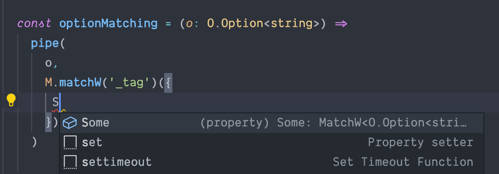
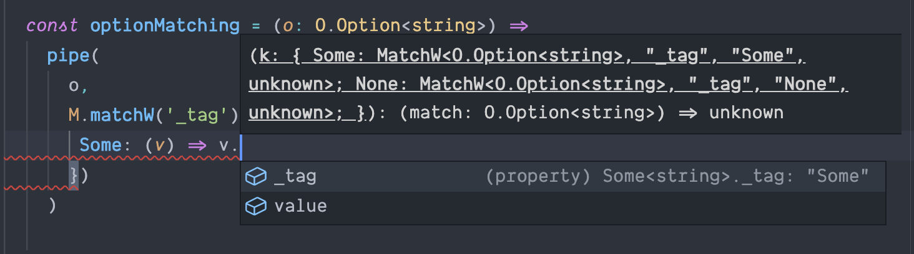

In the latest article, we talked about pattern matching
[Match](https://dev.to/stefano_regosa/typescript-pattern-matching-ne8) API.

 
In this article we gonna look into the `matchW` API , a wider match implementation where the match happens within a `pipe` function.


A `pipe` is a function of functions that pipes the value of an expression into a pipeline of functions.
This function takes an initial value and passes that as the argument(s) for the first internal function to use, then it takes the result from that function and passes it to another internal function. 

---

A [pipe](https://gcanti.github.io/fp-ts/modules/function.ts.html#pipe) typescript implementation can be found inside the `fp-ts` library so we need to install that library first.

yarn

```shell
yarn add fp-ts 
```
npm
```shell
npm install --save fp-ts 
```

# MatchW
With this api we don't need to specify via generic the matches or return type since both signatures are inferred within the pipe function.
The only thing we have to specify in order to implement our pattern matching function is the discriminated union.

Let's implement our `matchW` pattern-matching against the `fp-ts`  `Option`.

If we look at the fp-ts `Option` implementation 

```ts
export interface None {
  readonly _tag: 'None'
}

export interface Some<A> {
  readonly _tag: 'Some'
  readonly value: A
}

export type Option<A> = None | Some<A>
```
we see that the convention used was `_tag`, so we have to specify that inside our implementation as well.

```ts 
M.matchW('_tag')
```
Once we did that, the [LSP](https://langserver.org/) auto-complete will do the rest by providing suggestions via intellisense:

for each case


and each implementation



### Option MatchW

```ts
import * as M from 'pattern-matching-ts/lib/match'
import { pipe } from 'fp-ts/lib/function'
import * as O from 'fp-ts/lib/Option'

const optionMatching = (o: O.Option<string>) =>
  pipe(
    o,
    M.matchW('_tag')({
      Some: ({ value }) => 'Something: ' + value,
      None: () => 'Nothing',
    })
  )

assert.deepStrictEqual(optionMatching(O.some('data')), 'Something: data')
assert.deepStrictEqual(optionMatching(O.none), 'Nothing')
```

Following the previous example we can implement the pattern-matching against the `Either`.

### Either MatchW

```ts
import * as M from 'pattern-matching-ts/lib/match'
import { pipe } from 'fp-ts/lib/function'
import * as E from 'fp-ts/lib/Either'

type RGB = Record<'r' | 'g' | 'b', number>
const either = (maybeRgb: E.Either<string, RGB>) =>
  pipe(
    maybeRgb,
    M.matchW('_tag')({
      Left: ({ left }) => 'Error: ' + left,
      Right: ({ right: { r, g, b } }) => `Red: ${r} | Green: ${g} | Blue: ${b}`
    })
  )

assert.deepStrictEqual(either(E.right({ r: 255, g: 255, b: 0 })), 'Red: 255 | Green: 255 | Blue: 0')
```


Since the `matchW` discriminated union can extend also number let's see how we can implement a pattern-matching against HTTP codes 

```ts
import * as M from 'pattern-matching-ts/lib/match'
import { pipe } from 'fp-ts/lib/function'

interface ServerResponse<Code extends string | number> {
  readonly code: Code
}

interface Response<Body> {
  readonly response: {
    readonly body: Body
  }
}

interface Success extends ServerResponse<200>, Response<ReadonlyArray<string>> {}

interface NotFoundError extends ServerResponse<404> {}

interface ServerError extends ServerResponse<500> {
  readonly detail: string
}

type Responses = Success | NotFoundError | ServerError

const matchResponse = (response: Responses) =>
  pipe(
    response,
    M.matchW('code')({
      500: ({ detail }) => ({ message: 'Internal server error', detail }),
      404: () => ({ message: 'The page cannot be found!' }),
      200: ({ response }) => response.body,
      _: () => 'Unexpected response'
    })
  )

assert.deepStrictEqual(either(E.right({ r: 255, g: 255, b: 0 })), 'Red: 255 | Green: 255 | Blue: 0')
assert.deepStrictEqual(matchResponse({ code: 200, response: { body: ['data'] } }), ['data'])
assert.deepStrictEqual(matchResponse({ code: 500, detail: 'Cannot connect to the database' }), {
  message: 'Internal server error',
  detail: 'Cannot connect to the database'
})
assert.deepStrictEqual(matchResponse({ code: 404 }), { message: 'The page cannot be found!' })
```

[pattern-matching-ts **source-code**](https://github.com/nrdlab/pattern-matching-ts)

[pattern-matching-ts **NPM**](https://www.npmjs.com/package/pattern-matching-ts)